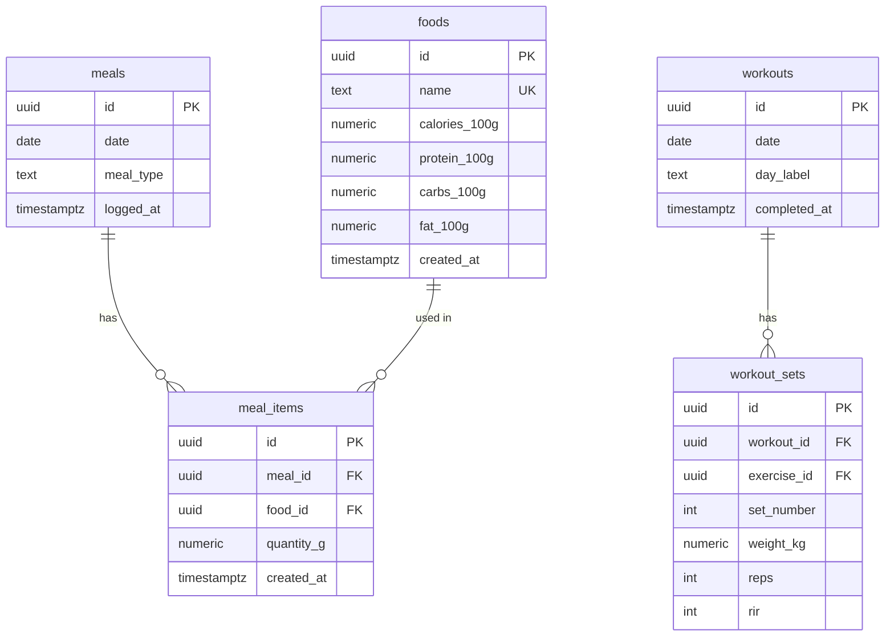

# Phase 1: Diet Logging

## Overview

Build the complete diet logging system — the first functional layer of Forge. After Phase 1, the owner can log every meal against a structured 5-card layout (Breakfast, Lunch, Snack, Dinner, Pre-bed), track running macro totals against calorie and protein targets, search from a seeded food database, create custom foods, and review any past day's diet. Today's page (the primary daily surface) hosts the inline diet flow; the `/diet` tab adds date navigation.

Phase 0 is complete: the DB schema, app shell, navigation, Supabase client pattern, seed data, and Vercel deployment are all in place. This phase builds on that foundation.

---

## Proposed Solution

Six deliverables built in dependency order (see brainstorm: docs/brainstorms/2026-06-06-forge-initial-brainstorm.md):

1. **Zod schemas + server actions layer** — all data mutations go through server actions
2. **Macro totals bar** — calories, protein, carbs, fat vs. auto-detected training/rest targets
3. **Meal cards** — 5 slots on Today view, each showing logged items + meal totals
4. **Add food flow** — food search autocomplete → grams → optimistic save
5. **Edit/delete** — inline grams edit or delete, single-tap confirm
6. **Custom food creation** — add new food to the `foods` table; appears in search immediately

---

## Key Decisions Made (SpecFlow Resolutions)

These decisions resolve gaps identified during spec analysis. They are final for implementation.

### D1: Pre-workout meal — use Snack slot
The diet plan has a pre-workout snack (banana + coffee, ~200 kcal at 5:45 AM). The 5-card layout from the brainstorm uses: Breakfast, Lunch, Snack, Dinner, Pre-bed. Pre-workout food logs under **Snack**. No 6th card. The snack slot is available all day and is the natural catch-all for between-meal items. This keeps the card layout exactly as specified.
*(see brainstorm: docs/brainstorms/2026-06-06-forge-initial-brainstorm.md — "5 cards (Breakfast, Lunch, Snack, Dinner, Pre-bed)")*

### D2: Training day detection is always date-parameterized
The macro targets query accepts a `date` string and checks `workouts` joined to `workout_sets` for that specific date — not "today." This makes the query correct on the `/diet` date navigation page (e.g., viewing last Tuesday shows last Tuesday's targets).

```ts
// lib/actions/diet.ts
async function isTrainingDay(date: string): Promise<boolean> {
  const supabase = createServiceClient()
  const { data } = await supabase
    .from('workouts')
    .select('id, workout_sets(id)')
    .eq('date', date)
    .limit(1)
    .single()
  return (data?.workout_sets?.length ?? 0) > 0
}
```

### D3: Macro targets (hard-coded from diet plan)
From `docs/diet-plan.md` (source of truth for this owner's plan):

| Day type | Calories | Protein | Carbs | Fat |
|---|---|---|---|---|
| Training | 1950 kcal | 160g | 200g | 55g |
| Rest | 1750 kcal | 160g | 150g | 55g |

These are constants in `lib/diet/targets.ts`. If the owner changes their plan, this file is updated.

### D4: Timezone — client passes the local date string
Server actions **never** compute `new Date().toISOString()` for the log date. The client (running IST, UTC+5:30) passes the local date as an explicit string argument: `format(new Date(), 'yyyy-MM-dd')` from `date-fns`. All server actions accept `date: string`. This prevents late-night IST logs landing on the wrong UTC date.

### D5: Optimistic update failure handling — toast + revert
When a server action to add a meal item fails, the optimistic item is immediately removed and a toast notification appears ("Failed to log — try again"). The pattern uses React 19's `useOptimistic` with `startTransition` wrapping the server action call.

### D6: Double-tap protection on Add food — disable on submit
The add food confirm button is disabled immediately on first tap and re-enabled only if the action fails. This prevents the duplicate row scenario where two identical `meal_items` are inserted.

### D7: Over-target macro bar visual state
When a macro total exceeds its target, the progress bar caps at 100% width and its fill color shifts to `text-destructive` / `bg-destructive` (the red design token). The number label still shows the actual value (e.g., "2100 / 1950 kcal").

### D8: Date nav lower bound — 90 days
The `/diet` date navigation disables the `<` (back) button when the selected date reaches 90 days before today. This aligns with the AI context window and prevents vacuous queries. "No data" on a past date shows empty cards (not an error state).

### D9: meals.logged_at is creation-only
On `meals` upsert, `logged_at` is excluded from the update set — it only records the first time a meal slot was created. Use `{ onConflict: 'date,meal_type', ignoreDuplicates: false }` and explicitly specify update columns (everything except `logged_at` and `id`).

### D10: Edit changes grams only
Tapping a logged item reveals an inline grams input for the existing `meal_item`. The food itself cannot be changed via edit — this is intentional. To log a different food, delete the item and re-add. This keeps the edit flow simple.

### D11: Food search strategy — case-insensitive substring
Food search uses `.ilike('name', '%query%')` — substring match, case-insensitive. This means typing "paneer" finds "Paneer (Low Fat)". Results limited to 20 items. Empty results show a "Create food" CTA inline.

### D12: Custom food — duplicate name error
If the user tries to create a food with a name that already exists (unique constraint violation), show an inline error: "A food named '[name]' already exists." The form stays open for them to adjust the name.

### D13: Grams input — numeric keyboard, no default
Grams input uses `type="number"` with `inputMode="decimal"` and `step="any"`. No default value — the field starts empty. Min: 1. Max: 5000 (5kg, absurd upper bound catches typos like "10000"). Decimals allowed (for oils measured in ml ≈ g).

---

## Schema Reference

The full schema is already migrated. Phase 1 only reads/writes these tables:



Key constraints:
- `meals` UNIQUE(date, meal_type) — always upsert
- `foods` UNIQUE(name) — upsert with `{ onConflict: 'name' }`
- Macros computed at query time: `quantity_g / 100.0 * per_100g_value` (never stored)

---

## Technical Approach

### Architecture

All mutations flow through server actions. No client-side fetch for CRUD. The `/diet` page and Today page share a `<DietView date={date} readonly={isPast} />` server component that renders the macro bar and meal cards. This is built once and used in both routes.

```
lib/
  diet/
    targets.ts          # TRAINING_TARGETS, REST_TARGETS constants
    macros.ts           # getMacrosForDate(date) — main data query
  actions/
    diet.ts             # logMealItem, deleteMealItem, updateMealItem, createFood
  schemas/
    diet.ts             # Zod schemas for all diet actions

components/
  diet/
    diet-view.tsx       # Server component: accepts date + readonly props
    macro-totals-bar.tsx  # Client — animated progress bars
    meal-card.tsx       # Client — card with food list + add flow
    food-search.tsx     # Client — debounced search input + results
    add-food-form.tsx   # Client — grams input + confirm
    custom-food-form.tsx  # Client — new food creation form

app/(app)/
  page.tsx              # Today: passes today's date to <DietView>
  diet/page.tsx         # Diet: date nav + <DietView date={selectedDate} readonly={isPast}>
```

### Macro Query Pattern

The core data function lives in `lib/diet/macros.ts` and is called server-side by `DietView`:

```ts
// lib/diet/macros.ts
export async function getMacrosForDate(date: string) {
  const supabase = createServiceClient()

  // Fetch all meal items with food data for the date
  const { data: meals } = await supabase
    .from('meals')
    .select(`
      id,
      meal_type,
      logged_at,
      meal_items (
        id,
        quantity_g,
        food:foods (
          id, name,
          calories_100g, protein_100g, carbs_100g, fat_100g
        )
      )
    `)
    .eq('date', date)

  // Check training day status for this date
  const { data: workout } = await supabase
    .from('workouts')
    .select('id, workout_sets(id)')
    .eq('date', date)
    .maybeSingle()
  const isTraining = (workout?.workout_sets?.length ?? 0) > 0

  // Compute totals per meal and overall
  // ... aggregation logic
  
  return { meals, isTraining, totals, targets }
}
```

### Server Actions Pattern

Follow the `lib/actions/logout.ts` template exactly:

```ts
// lib/actions/diet.ts
'use server'
import { revalidatePath } from 'next/cache'
import { createServiceClient } from '@/lib/supabase'
import { logMealItemSchema } from '@/lib/schemas/diet'

export async function logMealItem(date: string, mealType: string, foodId: string, quantityG: number) {
  const supabase = createServiceClient()

  // 1. Upsert the meal row (get or create)
  const { data: meal } = await supabase
    .from('meals')
    .upsert(
      { date, meal_type: mealType },
      { onConflict: 'date,meal_type', ignoreDuplicates: false }
    )
    .select('id')
    .single()

  // 2. Insert the meal item
  await supabase
    .from('meal_items')
    .insert({ meal_id: meal.id, food_id: foodId, quantity_g: quantityG })

  revalidatePath('/')       // Today page
  revalidatePath('/diet')   // Diet page
}
```

### Optimistic Updates (React 19 pattern)

```tsx
// In meal-card.tsx
const [optimisticItems, addOptimisticItem] = useOptimistic(
  items,
  (state, newItem) => [...state, newItem]
)

async function handleAddItem(foodId: string, quantityG: number) {
  const tempItem = { id: crypto.randomUUID(), food: selectedFood, quantity_g: quantityG, pending: true }
  
  startTransition(async () => {
    addOptimisticItem(tempItem)
    const result = await logMealItem(date, mealType, foodId, quantityG)
    if (!result.success) toast.error('Failed to log — try again')
  })
}
```

### shadcn Components Needed

Currently installed: Button, Card, Input. Need to add:

```bash
npx shadcn@latest add progress    # macro totals bars
npx shadcn@latest add badge       # macro pill labels (protein: 45g)
npx shadcn@latest add separator   # dividers in meal cards
npx shadcn@latest add sonner      # toast notifications (for error states)
```

For food search, check shadcn MCP first: `mcp__shadcn__search_items_in_registries` for "combobox" or "command" — likely needs `cmdk` under the hood.

---

## Implementation Phases

### Phase 1.1: Data Layer (No UI)

**Files to create/modify:**
- `lib/diet/targets.ts` — training/rest macro constants
- `lib/schemas/diet.ts` — Zod: `logMealItemSchema`, `deleteMealItemSchema`, `updateMealItemSchema`, `createFoodSchema`
- `lib/diet/macros.ts` — `getMacrosForDate(date: string)` query function
- `lib/actions/diet.ts` — `logMealItem`, `deleteMealItem`, `updateMealItem`, `createFood`, `searchFoods`

**Done when:** Can call server actions from a test script and see rows in Supabase dashboard. Training day detection returns correct boolean for a date with/without workout_sets.

### Phase 1.2: Macro Totals Bar

**Files:**
- `npx shadcn@latest add progress badge sonner`
- `components/diet/macro-totals-bar.tsx` — client component, animated progress bars
- `app/(app)/page.tsx` — calls `getMacrosForDate(today)`, renders `<MacroTotalsBar>`

**Visual spec:**
- 4 bars: Calories, Protein, Carbs, Fat
- Each: label left + `actual / target unit` right + progress bar
- Bar fill: `bg-primary` normally, `bg-destructive` when > 100%
- Stack vertically, consistent spacing

**Done when:** Today page loads with macro bar showing 0/1950 kcal (or correct target). Test by logging a row directly in Supabase and verifying the number updates on reload.

### Phase 1.3: Meal Cards (Read-Only First)

**Files:**
- `components/diet/meal-card.tsx` — Card with meal type label, item list, meal macro total
- `components/diet/diet-view.tsx` — Wraps all 5 meal cards + macro bar, accepts `date` + `readonly`
- `app/(app)/page.tsx` — Updated to use `<DietView date={today}>`
- `app/(app)/diet/page.tsx` — Date nav UI + `<DietView date={selected} readonly={isPast}>`

**Meal type display names** (internal → display):
- `breakfast` → Breakfast
- `lunch` → Lunch
- `snack` → Snack
- `dinner` → Dinner
- `prebed` → Pre-bed

**Done when:** Today page shows 5 meal cards with correct items from DB (test by inserting rows via Supabase dashboard). `/diet` page loads with `< Jun 7, 2026 >` date nav.

### Phase 1.4: Add Food Flow

**Files:**
- `components/diet/food-search.tsx` — debounced text input, calls `searchFoods`, shows results list
- `components/diet/add-food-form.tsx` — grams input + confirm button (disabled on submit)
- `meal-card.tsx` — "Add food" tap target opens inline food search

**Flow:**
1. Tap "+" on meal card → food search appears (inline, not modal)
2. Type → debounced 300ms → results appear (up to 20)
3. Empty results → "No results. Create '[query]'?" CTA
4. Select food → grams input appears
5. Enter grams → tap Confirm (disabled immediately) → optimistic add → success or toast + revert
6. Cancel via tap outside or X button

**Touch targets:** All interactive elements ≥44px min-height.

**Done when:** Can add a meal item on iPhone. Optimistic item appears instantly. Reload shows persisted item.

### Phase 1.5: Edit / Delete

**Files:**
- `meal-card.tsx` — tap item row reveals edit/delete affordances
- `components/diet/edit-item-form.tsx` — inline grams input (pre-filled with current value)

**UX:**
- Tap item row → row expands: shows current grams input (editable) + delete icon (right side, ≥44px)
- Grams input: change + tap "Save" (or blur) → `updateMealItem` server action
- Delete icon: single tap → `deleteMealItem` → optimistic removal
- Tap item row again (or elsewhere) → row collapses back to display mode

**Done when:** Can edit grams of a logged item. Can delete a logged item. Totals bar updates after both operations.

### Phase 1.6: Custom Food Creation

**Files:**
- `components/diet/custom-food-form.tsx` — name + 4 macro fields + submit
- Integration into `food-search.tsx` — "Create food" CTA at empty results

**Validation (Zod `createFoodSchema`):**
- `name`: string, min 2 chars, max 100 chars
- `calories_100g`: number, min 0, max 900
- `protein_100g`: number, min 0, max 100
- `carbs_100g`: number, min 0, max 100
- `fat_100g`: number, min 0, max 100
- Unique constraint error → inline error message

**Done when:** Can create "Homemade Dal" from the empty search results state, have it appear immediately in search, and log it to a meal.

---

## System-Wide Impact

### Interaction Graph
- `logMealItem` → upserts `meals` row → inserts `meal_items` row → `revalidatePath('/')` + `revalidatePath('/diet')` → both pages re-fetch `getMacrosForDate`
- `deleteM ealItem` → deletes `meal_items` row → same revalidation chain
- `createFood` → upserts `foods` row → no path revalidation needed (search is client-side debounced query, not cached at Next.js level)
- Training day detection reads `workouts` + `workout_sets` — Phase 2 writes these. Before Phase 2, training day always returns false (rest day targets). This is correct behavior: no workout logged = rest day.

### State Lifecycle Risks
- **Orphaned meals rows:** If `logMealItem` upserts the `meals` row but fails to insert `meal_item`, the meals row remains. This is harmless — empty meal rows have no display impact. No cleanup needed.
- **Stale optimistic items:** On server action failure, React 19 `useOptimistic` reverts state as soon as the transition completes with an error. The toast + revert pattern (D5) ensures the user sees feedback.
- **Double-tap race (C2):** Mitigated by disabling the confirm button on first tap (D6). Not fully eliminated for server-side but acceptable for single-user.

### API Surface Parity
- `getMacrosForDate` is called from both `app/(app)/page.tsx` (Today) and `app/(app)/diet/page.tsx` — both must pass a `date` string, never assume today.
- Server actions (`logMealItem`, etc.) are shared between both pages via the same `components/diet/` components.

---

## Acceptance Criteria

### Functional Requirements
- [x] Today page shows macro totals bar with calories, protein, carbs, fat vs. correct targets
- [x] Training day auto-detected: if `workout_sets` exist for today's date → 1950 kcal / 200g carbs / 55g fat targets; else 1750 / 150g / 55g (protein target 160g either way)
- [x] Today page shows 5 meal cards: Breakfast, Lunch, Snack, Dinner, Pre-bed
- [x] Each meal card shows logged items with per-item macro breakdowns + card total
- [x] Tapping a meal card reveals food search with debounced autocomplete
- [x] Food search shows up to 20 results, case-insensitive substring match
- [x] Empty search results shows "Create '[query]'" CTA
- [x] Adding a food: select → enter grams → confirm → optimistic instant update
- [x] Server action failure on add: optimistic item reverts + toast notification
- [x] Confirm button disabled immediately on tap (prevents duplicate submission)
- [x] Tapping a logged item reveals inline grams edit + delete affordance
- [x] Edit grams: change + save → item updates + totals recalculate
- [x] Delete: single tap → item removed + totals recalculate
- [x] Custom food creation: name + per-100g macros → saves to `foods` → available in search immediately
- [x] Custom food duplicate name: inline error ("A food named '...' already exists")
- [x] `/diet` page shows `< [date] >` navigation header
- [x] `/diet` defaults to today; navigating back shows that date's meals
- [x] Past dates on `/diet` are read-only (no add/edit/delete affordances)
- [x] Back button disabled at 90 days before today
- [x] Over-target macros: bar capped at 100% width, fill color shifts to destructive (red)
- [x] All tap targets ≥ 44px height

### Data Requirements
- [x] Server actions never compute dates server-side; client always passes local `date` string
- [x] `meals` rows upserted with `{ onConflict: 'date,meal_type' }` — no duplicates
- [x] `meals.logged_at` not overwritten on re-upsert
- [x] Macros computed at query time, never stored in `meal_items`

### Mobile UX
- [x] Food search numeric grams input shows decimal keyboard on iOS (`inputMode="decimal"`)
- [x] Minimum grams: 1. Maximum: 5000. Decimals allowed.
- [ ] Full workflow tested on iPhone via Safari (PWA installed)

---

## Dependencies & Risks

| Item | Risk | Mitigation |
|---|---|---|
| shadcn combobox / command component | May not be in base-luma registry | Check via `mcp__shadcn__search_items_in_registries` before building; if absent, build a simple `<Input>` + `<ul>` results list |
| `workout_sets` table empty until Phase 2 | Training day always returns false | Correct behavior — rest day targets until workouts are logged |
| Supabase free tier pause | DB unavailable | Daily app use prevents; not a Phase 1 concern |
| React 19 `useOptimistic` + server actions | Minor complexity vs. simpler `useState` | The pattern is well-documented in Next.js 16 docs; use it — it's the right tool |
| IST timezone date mismatch | Late-night logs on wrong date | Fully mitigated by D4 — client always passes `format(new Date(), 'yyyy-MM-dd')` |

---

## Files Checklist

### Create
- [x] `lib/diet/targets.ts`
- [x] `lib/diet/macros.ts`
- [x] `lib/schemas/diet.ts`
- [x] `lib/actions/diet.ts`
- [x] `components/diet/diet-view.tsx`
- [x] `components/diet/macro-totals-bar.tsx`
- [x] `components/diet/meal-card.tsx`
- [x] `components/diet/food-search.tsx`
- [x] `components/diet/add-food-form.tsx`
- [x] `components/diet/edit-item-form.tsx`
- [x] `components/diet/custom-food-form.tsx`
- [x] `lib/diet/types.ts` (added: shared type interfaces extracted to fix server-only leak)
- [x] `lib/diet/compute.ts` (added: pure macro compute functions extracted to fix server-only leak)

### Modify
- [x] `app/(app)/page.tsx` — replace stub with `<DietView date={today}>`
- [x] `app/(app)/diet/page.tsx` — replace stub with date nav + `<DietView>`

### shadcn to install
- [x] `npx shadcn@latest add progress`
- [x] `npx shadcn@latest add badge`
- [x] `npx shadcn@latest add separator`
- [x] `npx shadcn@latest add sonner`
- [x] Check + add combobox/command via shadcn MCP (used plain Input + results list — no combobox needed)

---

## Sources & References

### Origin
- **Brainstorm document:** [docs/brainstorms/2026-06-06-forge-initial-brainstorm.md](../brainstorms/2026-06-06-forge-initial-brainstorm.md)
  - Key decisions carried forward: 5-card meal layout (Breakfast/Lunch/Snack/Dinner/Pre-bed), macros computed at query time (never stored), Today is the hub with inline diet logging, training day auto-detected from workout_sets, server actions for all mutations

### Internal References
- DB schema: `supabase/migrations/001_initial_schema.sql`
- Server action template: `lib/actions/logout.ts`
- Supabase client pattern: `lib/supabase.ts:1`
- App layout: `app/(app)/layout.tsx`
- Bottom nav structure: `components/nav/bottom-nav.tsx`
- Auth pattern: `proxy.ts:1`
- Zod schema example: `lib/schemas/auth.ts`

### Project Spec
- `spec.md` — full data model and feature spec (§7 for schema, diet section for feature detail)
- `docs/diet-plan.md` — macro targets source of truth (training/rest day values)
